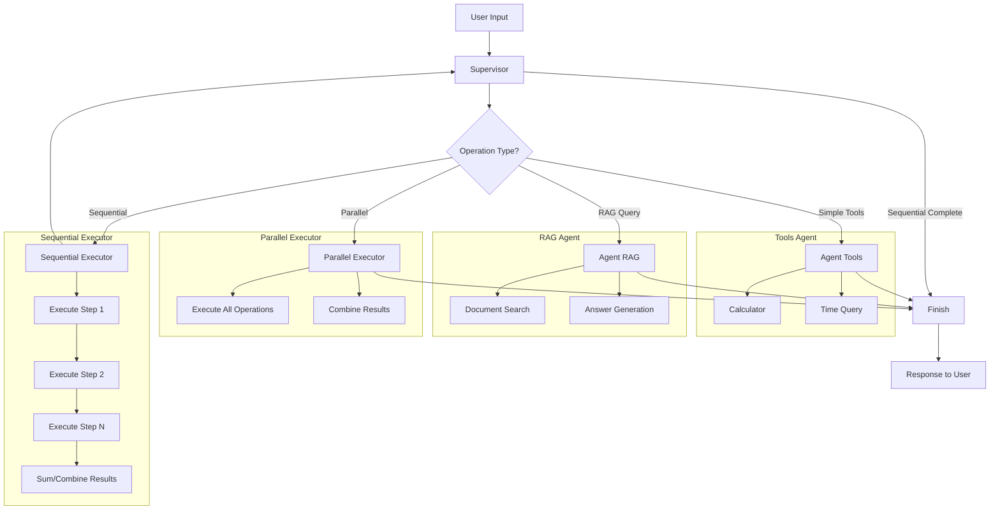

# Multi-Agent System with LangGraph

An intelligent chatbot that can execute simple, parallel, and sequential operations
using [LangGraph](https://langchain-ai.github.io/langgraph/).

> **NOTE:** This project doesn't make any LLM calls, it uses mocked tools and RAG,
> just to learn how to build a multi-agent chatbot using LangGraph.

## Features

- **Simple Operations**: Calculator, time query, RAG search
- **Parallel Operations**: Simultaneous execution of multiple tasks
- **Sequential Operations**: Step-by-step execution with intermediate decisions
- **Persistent History**: Maintains context between conversations
- **Interactive Interface**: CLI chat with debug and history options

## Installation

```bash
cd multi-agent
uv sync
```

## Usage

### Interactive Chat
```bash
uv run multi-agent
```

### Available Options
```bash
# Normal chat
uv run multi-agent

# Chat with debug (shows complete state)
uv run multi-agent --debug

# Chat with history (shows conversation history)
uv run multi-agent --historial

# Run tests
uv run multi-agent --test

# Show help
uv run multi-agent --help
```

## Usage Examples

### Simple Operations
- `What is 15*8?` → Calculator
- `What time is it?` → Time query
- `Summarize the manual` → RAG search

### Parallel Operations
- `What is 2+3 and 8/2?` → Executes both calculations simultaneously
- `Tell me the time and search the manual` → Time query and RAG in parallel

### Sequential Operations
- `Sum of 3x8 and 129/3` → Calculates 3x8, then 129/3, then sums the results
- `Search for information about tasks for this time` → Time query, then searches for tasks

## Architecture

The system is organized into modules:

- `state.py` - Shared system state
- `tools.py` - Tools and utilities
- `supervisor.py` - Intelligent supervisor
- `agent_tools.py` - Tools agent
- `agent_rag.py` - RAG agent
- `executors.py` - Parallel and sequential executors
- `graph.py` - LangGraph construction
- `chat.py` - Interactive chat interface
- `cli.py` - Main CLI

### System Flow Diagram



## Development

```bash
# Install development dependencies
uv sync --extra dev

# Run tests
uv run multi-agent --test

# Linting
uv run ruff check src/
uv run ruff format src/

# Type checking
uv run mypy src/
```
