# Multi-Agent API Debugger

An intelligent multi-agent system for API job management and automated debugging
using [LangGraph](https://langchain-ai.github.io/langgraph/).

> **NOTE:** This project uses mocked APIs and knowledge bases for demonstration purposes,
> focusing on the architecture and agent orchestration patterns.

## Features

- **🔧 API Operations**: Run jobs, get results, check system status
- **🐞 Error Debugging**: Automated root cause analysis and troubleshooting
- **📚 Knowledge Base**: Answer questions about the system and API
- **📝 Response Synthesis**: Format and present results clearly
- **🔄 Agent Orchestration**: Intelligent routing between specialized agents
- **💾 State Management**: Persistent conversation context
- **🧠 Long Term Memory (LTM)**: Learn from past interactions for smarter responses

## Installation

```bash
cd multi-agent-api-debugger
uv sync
```

## Usage

### Interactive Chat
```bash
uv run multi-agent chat
```

### Available Commands
```bash
# Interactive chat
uv run multi-agent chat

# Chat with debug mode
uv run multi-agent chat --debug

# Chat with history mode
uv run multi-agent chat --history

# Run demo
uv run multi-agent demo

# Run tests
uv run multi-agent test

# Show system info
uv run multi-agent info

# View memory statistics
uv run multi-agent memory --stats

# View recent memories
uv run multi-agent memory --recent 10

# Show help
uv run multi-agent --help
```

## Usage Examples

### API Operations
- `list all jobs` → Show available jobs
- `run job data_processing` → Execute a specific job
- `get job results job_001` → Get results for a job
- `check system status` → Monitor system health

### Error Debugging
- `debug job_003` → Analyze why job_003 failed
- `investigate the error` → Debug the last error
- `what went wrong with the last job?` → Root cause analysis

### Knowledge Queries
- `what is the API?` → Learn about the API
- `how do I authenticate?` → Get authentication help
- `explain job templates` → Learn about templates
- `what are common errors?` → Get error information

### Long Term Memory
- `multi-agent memory --stats` → View memory statistics and recent interactions
- `multi-agent memory --recent 10` → Show last 10 stored memories
- System automatically learns from all interactions to provide better responses

## Architecture

The system follows a multi-agent architecture with specialized agents:

### Core Agents
- **Supervisor** (`supervisor.py`) - Intelligent routing and orchestration
- **API Operator** (`api_operator.py`) - Handles all API operations
- **Debugger** (`debugger.py`) - Performs root cause analysis
- **Knowledge Assistant** (`knowledge_assistant.py`) - Answers questions using RAG
- **Response Synthesizer** (`response_synthesizer.py`) - Formats final responses

### Supporting Modules
- **Graph State** (`state.py`) - Shared state management
- **Graph Construction** (`graph.py`) - LangGraph workflow definition
- **Chat Interface** (`chat.py`) - Interactive user interface
- **CLI** (`cli.py`) - Command-line interface with Click
- **Demo** (`demo.py`) - System demonstration

### System Flow Diagram

```mermaid
graph TD
    A[👤 User Input] --> B[🤖 Supervisor]
    B --> C{Request Type?}
    
    C -->|API Operations| D[🛠️ API Operator]
    C -->|Debugging| E[🐞 Debugger]
    C -->|Knowledge Query| F[💬 Knowledge Assistant]
    
    D --> G[📝 Response Synthesizer]
    E --> G
    F --> G
    
    G --> H[Final Response]
    
    subgraph "API Operator"
        D --> D1[Run Jobs]
        D --> D2[Get Results]
        D --> D3[Check Status]
    end
    
    subgraph "Debugger"
        E --> E1[Error Analysis]
        E --> E2[Root Cause Analysis]
        E --> E3[Solution Recommendations]
    end
    
    subgraph "Knowledge Assistant"
        F --> F2[Answer Generation]
    end
    
    subgraph "Response Synthesizer"
        G --> G1[Format Results]
        G --> G2[Create Summary]
    end

    subgraph "Knowledge & Data Stores"
        I1[💾 Long-Term Memory]
        I2[📚 RAG Documents]
    end

    F -->|"Searches documentation"| I2
    F <-->|"Search porevious responsess"| I1
    G -->|"Store Q&A for later"| I1
    E <-->|"Search previous errors"| I1
```



## Development

```bash
# Install development dependencies
uv sync --extra dev

# Run tests
uv run multi-agent test

# Run tests with coverage
uv run pytest --cov=src --cov-report=term-missing

# Linting
uv run ruff check src/
uv run ruff format src/

# Type checking
uv run mypy src/
```

### Test Coverage

The project maintains high test coverage across all critical components:

- **Total Coverage**: 74%
- **Critical Components**: 90%+ coverage
- **Test Count**: 166 tests
- **Architecture Coverage**: Complete end-to-end testing

Key areas with excellent coverage:
- Multi-agent orchestration (97% coverage)
- Routing and planning (92% coverage)
- Intelligence functions (88% coverage)
- API operations (93% coverage)
- State management (100% coverage)

## Key Features

### Mocked Components
- **API Responses**: Simulated job operations and results
- **Knowledge Base**: Dictionary-based Q&A system
- **Error Patterns**: Predefined error scenarios for debugging
- **Root Cause Analysis**: Rule-based analysis engine

### Terminal-Optimized Design
- **Plain Text Output**: No markdown formatting for better terminal readability
- **Clear Structure**: Uses emojis and simple formatting for visual hierarchy
- **Interactive Demo**: Command-line demo with exit options (q to quit, s to skip)
- **Debug Modes**: Built-in debugging and history viewing capabilities

### Agent Specialization
Each agent has a specific role and set of capabilities:
- **Supervisor**: Routes requests and manages workflow
- **API Operator**: Handles all external API interactions
- **Debugger**: Analyzes errors and provides solutions (enhanced with LTM for similar cases)
- **Knowledge Assistant**: Answers questions from knowledge base (enhanced with LTM history)
- **Response Synthesizer**: Formats and presents results (stores interactions in LTM)

### Long Term Memory (LTM)
- **Semantic Search**: Uses ChromaDB + sentence transformers for intelligent similarity matching
- **Automatic Storage**: Every interaction is automatically saved for future reference
- **Smart Enhancement**: Agents use historical data to provide more informed responses
- **Privacy Focused**: Data stored locally, no external services required
- **Production Mode**: LTM only active in production mode (disabled for tests/mocks)

## 🤖 AI Tools Disclaimer

<details>
<summary>This project was developed with the assistance of artificial intelligence tools</summary>

**Tools used:**
- **Cursor**: Code editor with AI capabilities
- **Claude-4-Sonnet**: Anthropic's language model

**Division of responsibilities:**

**AI (Cursor + Claude-4-Sonnet)**:
- 🔧 Initial code prototyping
- 📝 Generation of examples and test cases
- 🐛 Assistance in debugging and error resolution
- 📚 Documentation and comments writing
- 💡 Technical implementation suggestions

**Human (Juanje Ojeda)**:
- 🎯 Specification of objectives and requirements
- 🔍 Critical review of code and documentation
- 💬 Iterative feedback and solution refinement
- ✅ Final validation of concepts and approaches

**Collaboration philosophy**: AI tools served as a highly capable technical assistant, while all design decisions, educational objectives, and project directions were defined and validated by the human.
</details>

## 📄 License

MIT License - see LICENSE file for details.

## 👥 Author

- **Author:** Juanje Ojeda
- **Email:** juanje@redhat.com
