# **Generic Design for a Multi-Agent System for Job Management and Automated Debugging**

## **1\. Overview**

This document outlines a generic architecture for a sophisticated multi-agent system designed to interact with an external platform via an API. The primary goal of this system is to provide a conversational interface for users to run jobs, retrieve results, and intelligently debug failures.  
The system is designed as a stateful graph of collaborating, specialized agents. Each agent has a distinct responsibility, a unique set of tools, and access to shared resources. This modular architecture is well-suited for implementation using frameworks like **LangGraph**, which allows for the creation of cyclical, state-driven agentic workflows.  
The core workflow involves a supervisor agent that interprets user requests, routes them to the appropriate specialist agent (e.g., for API interaction, debugging, or general Q\&A), and synthesizes the results into a coherent, user-friendly response. The system incorporates both short-term (Graph State) and long-term memory to ensure context awareness and continuous learning.

## **2\. Core Architecture and Data Flow**

The system operates as a graph where nodes represent agents and edges represent the flow of information. A central Graph State object is passed between nodes, allowing agents to read and write data transactionally within a single user request.

### **Key Architectural Concepts:**

* **Stateful Execution**: The entire process for a single user query is encapsulated within a state object. This object persists and evolves as it's passed from one agent to another, tracking everything from the initial task to the final result.  
* **Supervisor-Worker Model**: A central Supervisor agent acts as the brain, directing traffic and making decisions. The other agents are "workers" that execute specialized tasks.  
* **Shared Knowledge**: A Long-Term Memory (LTM) component, likely implemented as a vector database, stores the results of past interactions, including successful job runs, error analyses, and Q\&A sessions. This allows the system to learn and improve over time.  
* **Tool-Augmented Agents**: Agents are equipped with specific tools (e.g., API clients, analysis functions) and knowledge bases (e.g., technical documentation) to perform their tasks effectively.

### **System Workflow Diagram**

The following diagram illustrates the high-level architecture and the primary interaction paths between components.

```mermaid
graph TD  
    subgraph "User Interface"  
        User(👤 User)  
    end

    subgraph "Orchestration (LangGraph)"  
        Supervisor{🤖 Supervisor}  
    end

    subgraph "Specialized Agents"  
        API_Operator(🛠️ API Operator)  
        Debugger(🐞 Debugger)  
        Knowledge_Assistant(💬 Knowledge Assistant)  
        Response_Synthesizer(📝 Response Synthesizer)  
    end

    subgraph "Knowledge & Data Stores"  
        LTM[(💾 Long-Term Memory)]  
        Graph_State[📄 Graph State]  
        RAG_Docs((📚 RAG Documents))  
    end

    %% \--- Interaction Flows \---

    %% Start of the flow  
    User -->|"Initial Request (e.g., 'run job X')"| Supervisor

    %% Supervisor Routing  
    Supervisor -->|"Classifies task and routes"| API_Operator  
    Supervisor -->|"General question / inquiry"| Knowledge_Assistant  
    Supervisor -->|"Request to investigate a past error"| Debugger

    %% Job execution flow  
    API_Operator -->|"Results (Success or Error)"| Response_Synthesizer

    %% Debugging flow  
    Supervisor -->|"Error requires analysis"| Debugger  
    Debugger -->|"Provides Root Cause Analysis"| Response_Synthesizer  
    Debugger -->|"Needs more logs/data"| API_Operator

    %% Conversational flow  
    Knowledge_Assistant -->|"Generated Answer"| Response_Synthesizer  
    Knowledge_Assistant -->|"Searches documentation"| RAG_Docs

    %% Finalization flow  
    Response_Synthesizer -->|"Final user-facing response"| User

    %% State interaction is implicit at every step in the graph  
    Supervisor -.-> Graph_State  
    API_Operator -.-> Graph_State  
    Debugger -.-> Graph_State  
    Knowledge_Assistant -.-> Graph_State  
    Response_Synthesizer -.-> Graph_State

    %% Styling for clarity  
    style Supervisor fill:\#ff9,stroke:\#333,stroke-width:4px  
    style LTM fill:\#cff,stroke:\#333,stroke-width:2px  
    style Graph_State fill:\#fcf,stroke:\#333,stroke-width:2px
```

## **3\. Component Descriptions**

### **3.1. Agents**

#### **a) Supervisor**

The Supervisor is the central orchestrator and entry point of the graph. It maintains the overall plan and directs the workflow based on the current state and user input.

* **Responsibilities**:  
  * Parse the initial user request to understand intent.  
  * Determine the next agent to act (e.g., API Operator for actions, Debugger for analysis).  
  * Evaluate the output from other agents to decide the subsequent step.  
  * Manage the overall task execution flow.  
* **Inputs**: User query, current Graph State.  
* **Output**: An updated Graph State with a directive indicating the next agent to invoke.  
* **Recommended LLM Configuration**:  
  * **Characteristics**: Requires a powerful model with strong reasoning and instruction-following capabilities to make accurate routing decisions. Native support for tool-calling is necessary to define the routing schema.  
  * **Suggested Parameters**: temperature: 0.0. Routing should be as deterministic and consistent as possible.  
  * **Role & System Prompt**: The prompt must define its role as a "task orchestrator". It should be provided with the list of available agents as tools and instructed to select the most appropriate next step based on the conversation history and current state. The prompt should enforce a structured output for the routing decision.

#### **b) API Operator**

The API Operator is a tool-using agent responsible for all interactions with the external system's API. It does not perform any reasoning; it only executes predefined actions.

* **Responsibilities**:  
  * Execute API calls based on instructions from the Supervisor.  
  * Handle authentication and authorization for different tool categories.  
  * Report the raw results (success data or error messages) back to the state.  
* **Capabilities & Tools**:  
  * **Safe Tools**: Read-only operations that do not require authentication (e.g., list\_public\_jobs).  
  * **Authenticated Tools**: Operations requiring user-level authentication (e.g., run\_job, get\_job\_results).  
  * **Admin Tools**: Protected operations requiring admin privileges.  
  * **Workflows**: Pre-packaged sequences of multiple API calls that accomplish a complex task.  
* **Inputs**: A specific task from the Supervisor (e.g., {'tool': 'run\_job', 'params': {...}}).  
* **Output**: The raw JSON response or error from the API, written to the Graph State.  
* **Recommended LLM Configuration**:  
  * **Characteristics**: The primary requirement is robust and reliable tool-calling. A smaller, faster model optimized for function calling can be highly effective and cost-efficient.  
  * **Suggested Parameters**: temperature: 0.0. Tool calls must be accurate and deterministic.  
  * **Role & System Prompt**: The prompt should be direct and concise: "You are an API assistant. Your sole purpose is to execute the requested tool call with the provided parameters. Do not add any commentary. Only output the tool call."

#### **c) Debugger**

The Debugger is a specialized agent for investigating failures. It combines tool usage with an internal, domain-specific knowledge base to perform root cause analysis.

* **Responsibilities**:  
  * Analyze error logs and results provided in the Graph State.  
  * Formulate hypotheses about the cause of a failure.  
  * Use its tools to gather more information if needed.  
  * Provide a structured analysis of the root cause.  
* **Capabilities & Knowledge**:  
  * **Tools**: get\_logs, get\_job\_metadata, check\_system\_status.  
  * **Knowledge Base**: This must be populated with domain-specific expertise relevant to the target system, for example:  
    * System architecture and component dependencies.  
    * Common error patterns and their known causes.  
    * Interpretation of specific log formats.  
    * Performance metric baselines.  
* **Inputs**: Error details from the Graph State.  
* **Output**: A structured root\_cause\_analysis object added to the Graph State.  
* **Recommended LLM Configuration**:  
  * **Characteristics**: Requires a state-of-the-art reasoning model with a large context window to process extensive log files and complex technical data. It must excel at multi-step reasoning, logical deduction, and synthesizing information from multiple sources.  
  * **Suggested Parameters**: temperature: 0.3. A low temperature allows for some analytical creativity in forming hypotheses while remaining strongly grounded in the provided data.  
  * **Role & System Prompt**: The prompt should establish the persona of an "expert root cause analysis engineer". It should be instructed to "think step-by-step", clearly state its reasoning, and structure its final output. It should be made aware of its available tools and knowledge bases.

#### **d) Knowledge Assistant**

The Knowledge Assistant handles general conversational queries and provides information from a documented knowledge base.

* **Responsibilities**:  
  * Answer user questions that are not direct commands for the system's API.  
  * Use Retrieval-Augmented Generation (RAG) to find relevant information from private documentation.  
  * Access the Long-Term Memory to provide context from past conversations.  
* **Capabilities & Tools**:  
  * **RAG Engine**: A retriever connected to a vector store of internal documents.  
  * **LTM Access**: A tool to query the long-term memory.  
* **Inputs**: User question, conversation history.  
* **Output**: A generated textual answer.  
* **Recommended LLM Configuration**:  
  * **Characteristics**: A model with strong instruction-following and natural language generation skills, optimized for RAG. It must be able to synthesize an answer based strictly on the retrieved context.  
  * **Suggested Parameters**: temperature: 0.7. This allows for a more natural, conversational, and less robotic tone in the generated answer.  
  * **Role & System Prompt**: The prompt must contain a strong directive: "You are a helpful assistant. Answer the user's question based *exclusively* on the provided sources. If the answer is not in the sources, state that you do not have that information. Do not use your own knowledge."

#### **e) Response Synthesizer**

The Response Synthesizer is responsible for formatting the final output for the user and for saving knowledge. It ensures the user receives a clear, concise, and helpful message.

* **Responsibilities**:  
  * Take the raw data from the Graph State and synthesize it into natural language.  
  * Format the response appropriately (e.g., using Markdown).  
  * Consolidate key information from the interaction and save it to the Long-Term Memory.  
* **Inputs**: The complete, final Graph State.  
* **Output**: A user-facing string and a structured object for storage in the LTM.  
* **Recommended LLM Configuration**:  
  * **Characteristics**: Requires a model with excellent summarization and high-quality prose generation capabilities. It needs to transform structured and raw data into a coherent and easy-to-understand narrative.  
  * **Suggested Parameters**: temperature: 0.6. This allows for fluid and natural-sounding language while still adhering closely to the facts in the input data.  
  * **Role & System Prompt**: The prompt should define its role as a "communications specialist". It should be given instructions on the desired tone (e.g., "helpful, professional, and clear") and format ("Use Markdown for readability. Summarize the key findings first."). A separate prompt might be used for its secondary task of generating a concise summary for the LTM.

### **3.2. Shared Resources**

#### **a) Graph State**

The short-term memory for a single, self-contained task. It is a dictionary-like object that is passed through the graph.

* **Implemented Schema**:  
  * goal: The initial user request.  
  * todo\_list: A list of task dictionaries with status, agent, priority, and dependencies. Each task includes:
    * id: Unique task identifier
    * description: Human-readable task description
    * agent: Assigned agent for execution
    * status: pending, in_progress, completed, failed
    * priority: Numeric priority level
    * dependencies: List of task IDs that must complete first
    * parameters: Task-specific parameters
    * result: Task execution result
    * error: Error information if task failed  
  * results: A dictionary to store raw results from agents.  
  * error\_info: Contains details of any errors encountered.  
  * root\_cause\_analysis: Structured output from the Debugger.  
  * final\_response: The user-facing message generated by the Response Synthesizer.
  * route: Current routing decision (api_operator, debugger, knowledge_assistant, response_synthesizer, done).
  * next_agent: Next agent to invoke for flow control.
  * knowledge_summary: Structured knowledge extracted from interactions.

#### **b) Long-Term Memory (LTM)**

The persistent knowledge base of the system. It enables learning and context retention across multiple sessions.

* **Current Status**: Not implemented in the current version (focused on core architecture).  
* **Future Implementation**: A vector database is recommended.  
* **Planned Stored Data**:  
  * Embeddings of question-answer pairs.  
  * Summaries of completed job runs and their outcomes.  
  * Structured data from debugging sessions (error \-\> root cause \-\> solution).  
* **Planned Access**:  
  * **Write**: The Response Synthesizer will write to the LTM at the end of a successful workflow.  
  * **Read**: The Debugger and Knowledge Assistant will read from the LTM to improve their responses.

## **4\. Implementation Notes**

* **Current Implementation**: The system is implemented using LangGraph with a simplified flow for demonstration purposes.  
* **State Management**: The Graph State object is implemented as a Pydantic TypedDict (GraphState) extending MessagesState for type safety and consistency.  
* **Tool Definition**: Tools for the API Operator and Debugger are implemented as mock functions with typed inputs and outputs for reliable execution.  
* **Supervisor Logic**: The Supervisor node uses regex-based routing logic to determine the next agent, with a comprehensive todo_list system for task planning.  
* **Error Handling**: The graph includes error-handling mechanisms where agents update the state with errors, and the Supervisor can route to the Debugger for analysis.  
* **Mocking Strategy**: External services (APIs, LLMs, RAG) are mocked to focus on the core architecture and agent orchestration patterns.  
* **Future Enhancements**: The system is designed to easily integrate real LLMs, APIs, and LTM when moving from the current mock-based implementation to production.
